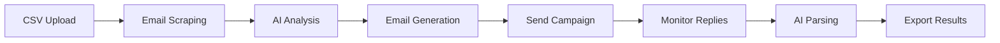

# 🏢 VenueHooper - Email Campaign Automation System

[](https://your-app-url.streamlit.app)
[](https://www.python.org/downloads/)
[](https://opensource.org/licenses/MIT)

A complete venue outreach automation system that scrapes emails, sends personalized outreach, and parses replies using AI.


## 🚀 Live Demo

Try the live application: [**VenueHooper Demo**](https://your-deployment-url.streamlit.app)

## ✨ Features

- **🔍 Smart Email Scraping**: Playwright + Requests hybrid approach
- **🤖 AI-Powered Analysis**: OpenAI venue categorization and personalization
- **📧 Bulk Email Campaigns**: Resend API integration with delivery tracking
- **📬 Automatic Reply Monitoring**: Gmail API integration
- **🧠 AI Reply Parsing**: Extract structured booking data from responses
- **📊 Complete Analytics**: Campaign metrics and CSV export
- **🧪 Step-by-Step Testing**: Individual component testing interface

## 🎯 Workflow



## 🚀 Quick Start

### Option 1: Deploy on Streamlit Cloud (Recommended)

1. **Fork this repository**
2. **Connect to Streamlit Cloud**: [share.streamlit.io](https://share.streamlit.io)
3. **Add your secrets** in Streamlit Cloud dashboard:
   ```toml
   [secrets]
   RESEND_API_KEY = "your_resend_key"
   OPENAI_API_KEY = "your_openai_key"
   TEST_EMAIL = "your_test_email@gmail.com"
   ```
4. **Deploy** - Your app will be live at `https://your-app.streamlit.app`

### Option 2: Local Development

```bash
# Clone repository
git clone https://github.com/yourusername/venuehooper.git
cd venuehooper

# Install dependencies
pip install -r config/requirements.txt
playwright install  # Install browser engines

# Configure environment
cp config/.env.example config/.env
# Edit config/.env with your API keys

# Start application
python3 main.py
```

### Option 3: Docker Deployment

```bash
# Build image
docker build -t venuehooper .

# Run container
docker run -p 8501:8501 \
  -e RESEND_API_KEY=your_key \
  -e OPENAI_API_KEY=your_key \
  venuehooper
```

## 📋 Requirements

### API Keys Required

| Service | Purpose | Get API Key |
|---------|---------|-------------|
| **Resend** | Email sending | [resend.com/api-keys](https://resend.com/api-keys) |
| **OpenAI** | AI analysis & parsing | [platform.openai.com/api-keys](https://platform.openai.com/api-keys) |
| **Gmail API** _(Optional)_ | Reply monitoring | [console.cloud.google.com](https://console.cloud.google.com) |

### Dependencies
- Python 3.9+
- Streamlit
- Playwright
- OpenAI
- Pandas
- See [`config/requirements.txt`](config/requirements.txt) for complete list

## 🎯 Usage

### 1. Web Interface
The main application provides 6 tabs:

1. **📁 Upload CSV** - Import venue data
2. **🔍 Scrape Emails** - Extract contact information  
3. **📧 Send Campaigns** - AI-powered personalized outreach
4. **📬 Manage Replies** - Monitor and parse responses
5. **📊 Results** - Analytics and export
6. **🧪 Step Testing** - Individual component testing

### 2. Command Line Testing
```bash
# Test complete workflow
python3 scripts/test_workflow_steps.py

# Test email sending only
python3 test_email.py

# System validation
python3 scripts/start.py --test
```

## 📊 Sample Data Format

Input CSV should contain:
```csv
name,category,address,phone,website,google_maps_link
The Rooftop NYC,Bar,230 5th Ave New York NY,212-555-0123,https://example.com,https://maps.google.com/?q=rooftop+nyc
```

Output includes all input data plus:
- Scraped email addresses
- AI venue analysis
- Campaign delivery status
- Parsed reply data (availability, pricing, contacts)

## 🏗️ Architecture

```
📦 VenueHooper/
├── 📁 src/
│   ├── automation/     # Gmail integration
│   ├── ui/            # Streamlit interface
│   └── utils/         # Email scraping
├── 📁 config/         # Configuration
├── 📁 data/          # CSV files
├── 📁 scripts/       # Utilities
└── 📁 docs/          # Documentation
```

## 🚀 Deployment Options

### Streamlit Cloud (Free)
- **✅ Pros**: Free, easy setup, automatic updates
- **❌ Cons**: Public repos only, limited resources
- **Setup**: Connect GitHub repo to [share.streamlit.io](https://share.streamlit.io)

### Heroku
- **✅ Pros**: Easy deployment, good for small apps
- **❌ Cons**: Paid plans, dyno sleeping
- **Setup**: Use provided `Procfile` and `runtime.txt`

### Railway
- **✅ Pros**: Modern platform, good free tier
- **❌ Cons**: Newer platform
- **Setup**: Connect GitHub, auto-deploy

### DigitalOcean App Platform
- **✅ Pros**: Scalable, good performance
- **❌ Cons**: Paid service
- **Setup**: Use provided `app.yaml`

### Google Cloud Run
- **✅ Pros**: Pay-per-use, highly scalable
- **❌ Cons**: More complex setup
- **Setup**: Use provided `Dockerfile`

## 🔧 Configuration

### Environment Variables
```bash
# Required
RESEND_API_KEY=re_your_key_here
OPENAI_API_KEY=sk-your_key_here
TEST_EMAIL=your_test_email@gmail.com

# Optional
ORG_NAME=YourCompany
YOUR_NAME=Your Name
YOUR_PHONE=555-555-5555
FORCE_TEST_EMAIL=true  # Redirect all emails to TEST_EMAIL
```

### Streamlit Secrets (for cloud deployment)
```toml
# .streamlit/secrets.toml
RESEND_API_KEY = "your_resend_key"
OPENAI_API_KEY = "your_openai_key"
TEST_EMAIL = "your_test_email@gmail.com"
ORG_NAME = "Your Company"
YOUR_NAME = "Your Name"
```

## 🧪 Testing

The system includes comprehensive testing:

```bash
# Full workflow test
python3 scripts/test_workflow_steps.py

# Individual component tests
python3 test_email.py                    # Email sending
python3 scripts/start.py --test          # System validation
python3 test_step_by_step.py            # Complete pipeline
```

Or use the **Step Testing** tab in the web interface for interactive testing.

## 📈 Metrics & Analytics

Track your campaigns:
- **Email Success Rate**: Delivery statistics
- **Response Rate**: Reply percentages  
- **Venue Interest**: AI-categorized responses
- **Booking Conversion**: Structured venue data

## 🤝 Contributing

1. Fork the repository
2. Create a feature branch (`git checkout -b feature/amazing-feature`)
3. Commit your changes (`git commit -m 'Add amazing feature'`)
4. Push to the branch (`git push origin feature/amazing-feature`)
5. Open a Pull Request

## 📄 License

This project is licensed under the MIT License - see the [LICENSE](LICENSE) file for details.

## 🆘 Support

- **Documentation**: Check the [`docs/`](docs/) folder
- **Issues**: [GitHub Issues](https://github.com/yourusername/venuehooper/issues)
- **Discussions**: [GitHub Discussions](https://github.com/yourusername/venuehooper/discussions)

## ⚖️ Legal Notice

**Important**: This tool is for legitimate business outreach only. Users must comply with:
- CAN-SPAM Act (US)
- GDPR (EU)  
- Local email marketing regulations
- Platform terms of service

Always obtain proper consent and provide unsubscribe options.

---

Made with ❤️ for venue professionals and event planners